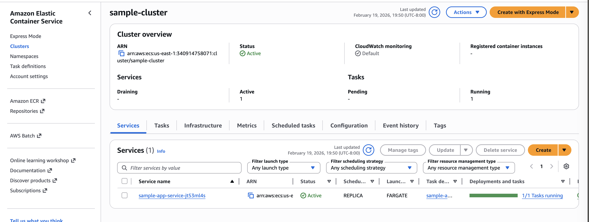
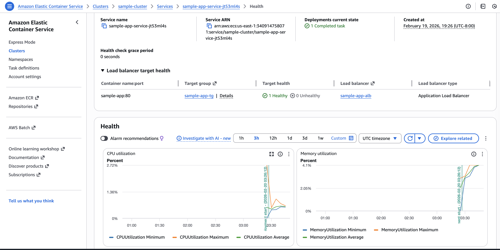
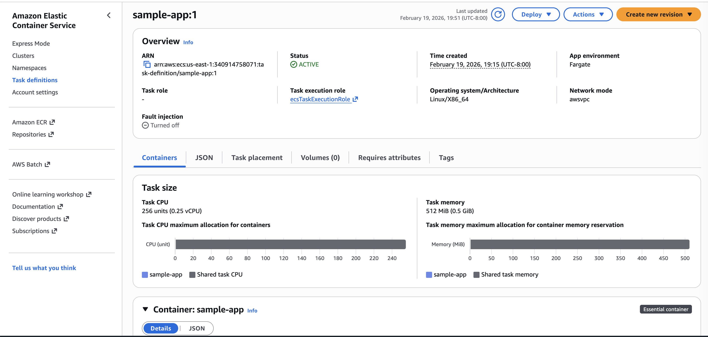
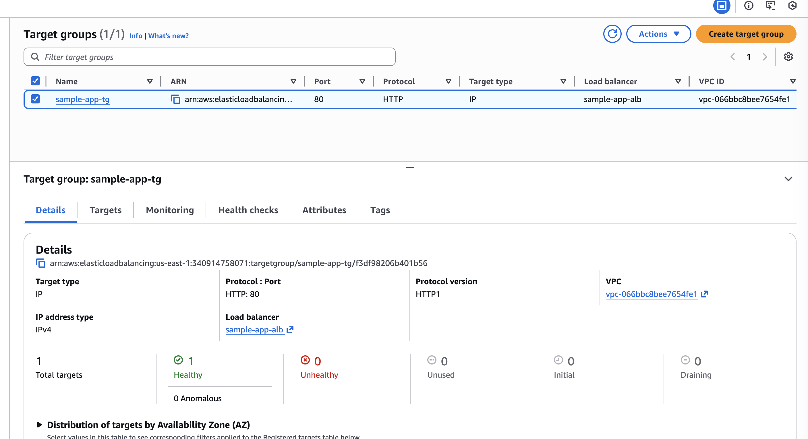
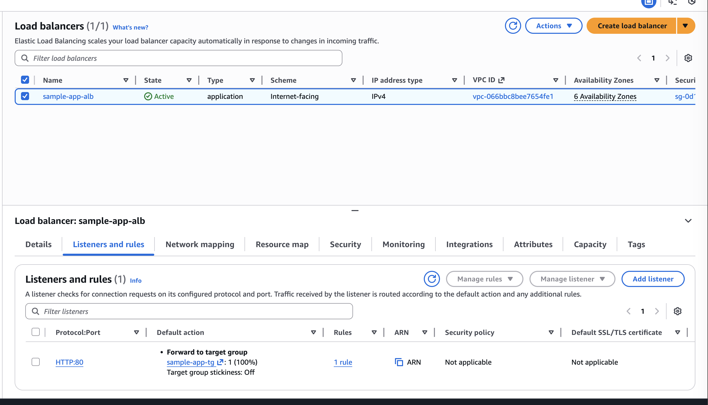
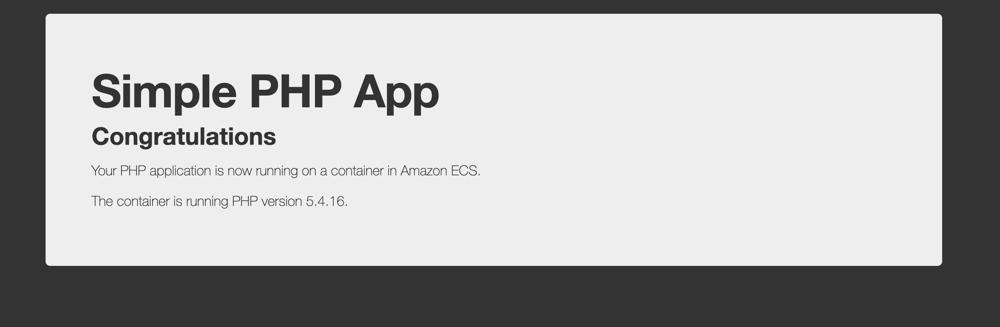

# 🚀 Deploy Docker Containers on Amazon ECS (Fargate)

The workshop demonstrates how to deploy a Docker-based application using:

* Amazon ECS
* AWS Fargate
* Application Load Balancer
* Target Groups
* CloudWatch monitoring

---
Deploy Docker Containers on Amazon ECS

This tutorial walks through:

1. Creating a task definition
2. Defining an ECS service
3. Configuring a cluster
4. Launching the service
5. Accessing the application via Load Balancer DNS
6. Cleaning up resources

---

## 🏗 Architecture Overview

User → Application Load Balancer → Target Group → ECS Service → Fargate Task (Docker Container)

### Infrastructure Components

| Component     | Configuration                             |
| ------------- | ----------------------------------------- |
| Cluster       | sample-cluster                            |
| Launch Type   | AWS Fargate                               |
| Service       | sample-app-service                        |
| Desired Tasks | 1                                         |
| CPU           | 0.25 vCPU                                 |
| Memory        | 0.5 GB                                    |
| Load Balancer | Internet-facing Application Load Balancer |
| Listener      | HTTP : 80                                 |
| Target Type   | IP                                        |
| Health Checks | Healthy                                   |

---

## 📸 Deployment Screenshots

### 1️⃣ ECS Cluster Overview

### 2️⃣ ECS Service Running

### 3️⃣ Task Definition Configuration

### 4️⃣ Target Group Health Check

### 5️⃣ Application Load Balancer

### 6️⃣ Running Application (PHP Container)

---

## ⚙️ What This Project Demonstrates

* Deploying Docker containers without managing servers
* Understanding ECS task definitions
* Creating scalable services
* Integrating Load Balancers with container services
* Verifying container health
* Public application routing
* Cleaning up AWS resources to avoid charges

---

## 🧠 Key Concepts Learned

* How ECS Services maintain desired task count
* Difference between Task Definition and Service
* How Fargate removes EC2 management
* How ALB forwards traffic to IP-based targets
* Importance of Health Checks
* Resource cleanup workflow

---

## 💰 Cost Consideration

Using Fargate (0.25 vCPU / 0.5 GB configuration):

Approximate cost: ~$0.004 per hour
Resources were deleted after testing to prevent charges.

---

## 🗑 Cleanup Process

The following resources were deleted after testing:

* ECS Cluster
* ECS Service
* Fargate Tasks
* Load Balancer
* Target Group

This ensures no ongoing AWS charges.

---

## 🎯 Future Improvements

* Infrastructure as Code (Terraform/CDK)
* HTTPS using ACM
* CI/CD Pipeline
* Auto Scaling
* Custom Domain
* Observability with alarms

---

